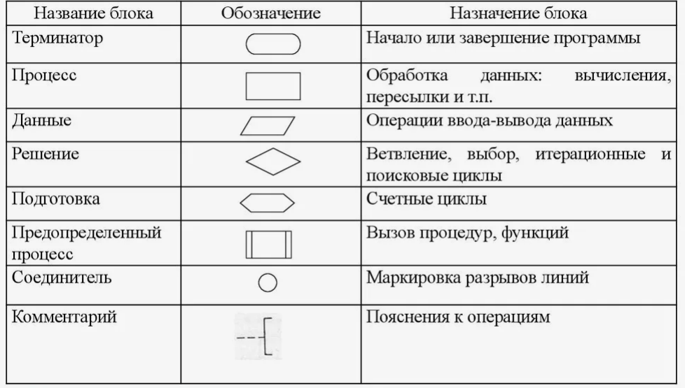
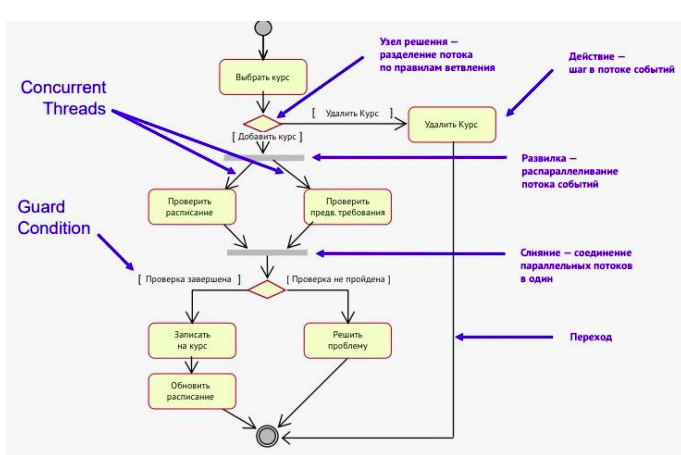
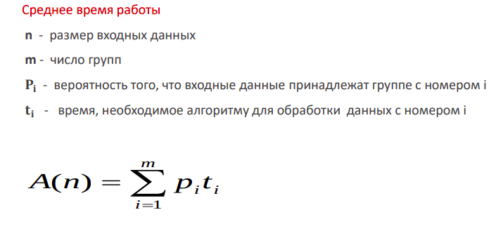
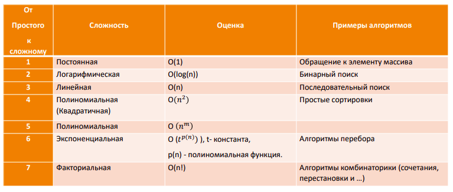
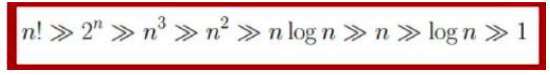

## Тема 1. Анализ алгоритмов. Асимптотическая сложность.

### Алгоритмизация
-процесс создания алгоритмов для решения конкретных задач. Применяется в разработке ПО.

### Алгоритм
предписание, однозначно задающее процесс преобразования
исходной информации в виде конечной последовательности
дискретных шагов, приводящих к результату.

### Свойства алгоритма
- дискретность - упорядоченное выполнение простых шагов за конечный отрезок времени.
- понятность - все команды алгоритма доступны его исполнителю
- детерменированность - алгоритм всегда выдает один и тот же результат для тех же данных
- конечность - число шагов конечно
- результативность - известно, что является результатом

### Однозначный алгоритм
-выдает один и тот же результат для одних и тех же данных.

### Способы записи алгоритма
- Естественный язык - понятен всем носителям языка, не требует специального синтаксиса. Но неоднозначен и избыточен.
- Ограниченный естественный язык - оставляем только однозначные слова и убираем неоднозначность и избыточность.
- Схематический - блок-схемы (flowchart) или UML или activity-diagram
- Псевдоязык (псевдокод)

### блок-схемы или flowchart
Способ схематического описания алгоритма

### Activity diagram 
описывают жизненный цикл приложения, сайта, программы, пользовательский путь и тд..

Основные элементы Activity diagram
- Initial node
- Action - отдельный шаг
- Control flow (переход) - линия со стрелкой, связывающая активности
- Desicion (решение) - ромб, дающий выбор куда идти по схеме дальше.
- Merge - несколько путей сливаются обратно.
- Fork/Join - разбивает и потом объединяет параллельные пути выполнения

### Корректный алгоритм
-на каждый ввод получаем правильный вывод.

### Сложность алгоритма
Бывает временная (число операций) и емкостная (число памяти). Далее говорим о временной сложности.

### Классы входных данных алгоритма
- Наилучший случай - когда алгоритм выполнится за минимальное время.
- Наихудший случай - когда алгоритм выполнится за максимальное время
- Средний случай - обычно берется как среднее время выполнения (учитывая вероятность каждого вида входных данных)

### Асимптотическая сложность
скорость времени работы алгоритма в зависимости от объема входных данных.

Для этого используется O-большое, которое возвращает множество функций, ограничивающих сверху исходную функцию.

