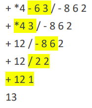
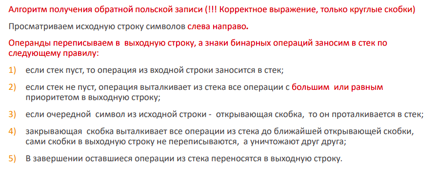
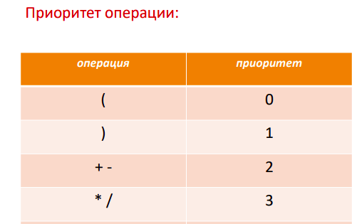
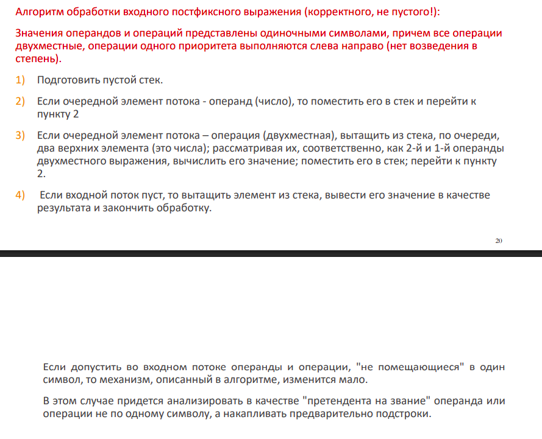

## Тема 2. Абстрактные типы данных (АТД). Список, стек, очередь. Постфиксная нотация.

### Динамические множества
-множества изменяемой длины.

### Successor и predecessor
- successor(dataStruct, x) - найти ближайший объект, превышающий x.
- predecessor(dataStruct, x) - найти ближайший меньший к x объект.

### Абстрактный тип данных (АТД)
скрывает реализацию от клиентов и может работать внутри по-разному в зависимости от реализации. 

Например, стек может быть реализован через LinkedList, ArrayList или через Array.

У АТД есть интерфейс - набор методов, полей и тд для работы с ним. Интерфейс не зависит от реализации АТД.

### Примеры АТД
- список
- стек
- очередь
- дек (Dequeue)
- PriorityQueue

P.S двунаправленный стек и двунаправленная очередь по сути одно и то же.

### Структура данных
-конкретная реализация АТД. Например, StackArray, LinkedList, ArrayList, StackList - это все структуры данных.

### LinkedList
- добавление элемента за О(1)
- доступ к элементу за O(n)
- расход памяти на указатели внутри каждого Node
- нельзя делать некоторые операции, по типу бинарного поиска.
- Соседние элементы в памяти расположены не рядом, это мешает использовать кеш процессора.

### ArrayList
- добавление элемента может привести к переаллокации памяти для увеличения массива.
- доступ к элементу за О(1)
- обычно есть capacity, то есть массив под капотом имеет размер навырост.

### Stack и Queue
Stack реализует парадигму LIFO - Last in first out.

Queue реализует парадигму FIFO - first in first out.

У Stack и Queue могут быть исключения StackOverflow/QueueOverflow и StackUnderflow/QueueUnderflow

Очередь можно реализовать через кольцевой массив.

## Далее рассмотрим как использовать стек для постфиксной нотации арифметических выражений.

### формы записи арифметических выражений
- инфиксная (обычная)
- префиксная (польская запись) (оператор, потом 2 операнда)
- постфиксная (обратная польская запись) (2 операнда, потом оператор)

### вычисление постфиксной записи делается за 1 проход!

В префиксной и постфиксной форме не нужны скобки - тем они хороши.

### Как читать префиксную запись

1. доходим слева направо до первого места, где есть 3 символа вида [оператор цифра цифра]

2. заменяем эти 3 символа на результат

3. повторяем шаги 1 и 2

### как читать постфиксную запись
1. доходим слева направо до первого места, где есть 3 символа вида [цифра цифра оператор]

2. заменяем эти 3 символа на результат

3. повторяем шаги 1 и 2

### алгоритм конвертации инфиксной в постфиксную запись

### алгоритм вычисления постфиксной записи

