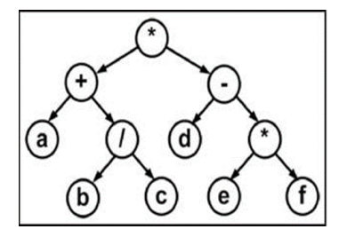

## Тема 3: Деревья. Binary search tree (BST)

### Дерво типа Т
- либо пустое дерево
- либо узел Т с конечным числом поддеревьев

### Способы изображения дерева
- вложенные множества (по типу кругов Эйлера)
- вложенные скобки
- отступы 
- граф (самый частый способ)

### Бинарное дерево 
Каждый узел имеет поля
- key
- parent (у корня = null)
- left (может быть nullptr)
- right (может быть nullptr)

### Термины дерева
- корневой узел - самый верхний узел дерева
- лист (терминальный узел) - узел без дочерних элементов
- внутренний узел - узел хотя бы с 1 потомком, то есть узел, который не является листом.
- глубина вложенности узла - длина пути от этого узла до корня.
- высота узла - максимальная длина нисходящего пути от этого узла к самому нижнему листу.
#### высота дерева = высота корневого узла
или же высота - максимальная длина пути от корня до листа.

### уровни дерева
Все узлы разбиты на уровни. Корень имеет нулевой уровень.

### степень узла и дерева
- степень узла - число его потомков.
- степень дерева - максимальная из степеней всех узлов. 

У бинарного дерева степерь всех узлов 2 и сама его степень равна 2.

### строго бинарное дерево
-когда каждый внутренний узел (не лист) имеет ровно 2 потомка.

### совершенное дерево
-строго бинарное дерево, все листы которого находятся на одном уровне.

В совершенном дереве на каждом уровне есть 2^(level) узлов.

### сбалансированное дерево
-для любого узла высоты правого и левого поддерева отличаются не более, чем на 1

### идеально сбалансированное дерево
-для любого узла число узлов в правом и левом поддеревьях отличается не более, чем на 1

### формулы для высоты бинарного дерева
Если в дереве n узлов, то:
- максимальная высота = n
- минимальная высота = floor(log2(n))

## Обходы дерева (traversals)
далее идут следующие обозначения
V - корень
L и R - левое и правое поддеревья

### Прямой обход (pre-order)
VLR

Корень -> левое поддерево -> правое поддерево.

Этот обход начинаем из корня. 

Если использовать дерево для записи арифметического выражения, то такой обход даст префиксную запись.

`*+a/bc-d*ef`

### Симметричный обход (in-orddr)
LVR

Левое поддерево -> корень -> правое поддерево.

Этот обход начинаем с крайнего левого листа. 

Такой обход даст инфиксную запись.

`a+b/c*d-e*f`

### Обратный обход (post-order)
LRV
Левое поддерево -> правое поддерево -> корень.

Этот обход начинаем с крайнего левого листа. 

Такой обход даст постфиксную запись.

`abc/+def*-*`

## Бинарное дерево поиска (binary search tree - BST)
узлы упорядочены по ключам. Узлы уникальны, ибо их ключи уникальны.  Может использоваться для реализации множества Set или PriorityQueue...

