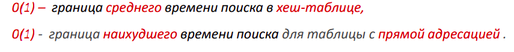
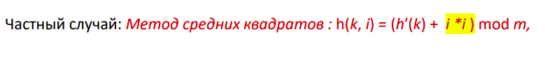
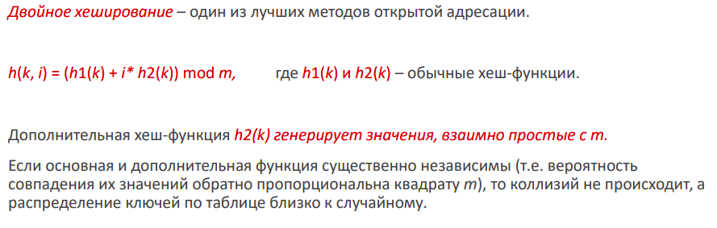

## Тема 5. Хеш-таблицы.
### Примеры АТД
- список
- стек
- очередь
- дек
- дерево
- PriorityQueue
- Set
- ассоциативный массив

### Ассоциативный массив
В нем хранятся пары ключ-значение. Причем ключи уникальны. 

В с++ unordered_map, в python dict() - это все ассоциативные массивы.

### Таблица прямого доступа
Пусть нам надо сделать хранение аккаунтов сотрудников с телефоном в качестве ключа. Должны выполняться эффективно вставка, поиск и удаление элементов. 

Номера телефонов 001-999
Число сотрудников 100

Можно использовать массив - тогда поиск будет линейным (или логарифмическим через бинпоиск в отсортированном массиве. Но в отсортированном массиве удаление и вставка дорогие).

Если использовать сбалансированное бинарное дерево поиска (AVL-tree), то операции вставки, поиска и удаления будут за О(log(n))

Таблица прямого доступа - большой массив, где ключ будет индексом. То есть индексом будет номер телефона - нужен массив длины 1000. Тогда поиск элемента, вставка и удаления О(1). Но нужно много памяти.

Можно сделать аналог таблицы прямого доступа, но через хеширование - получится хеш таблица...

Таблица прямого доступа использует технологию прямой адресации - когда элемент с ключем К хранится в ячейке с индексом К. 

### Хеш-таблица
В хеш-таблице берется хеш-функция от ключа. И уже хеш ключа будет индексом в таблице. Но могут возникать коллизии, когда 2 разных ключа имеют одинаковый хеш.

### Свойства хеш-функции
1. эффективно вычислима
2. равномерно распределяет ключи, минимизирует коллизии.

Большинство хеш-функций преобразуют любой набор информации в целое неотрицательное число (как раз индексом массива может быть).

### Идеальная хеш-функция
Без коллизий преобразует ключ в хеш за О(1) в худшем случае.

### Методы решения коллизий

1. Метод цепочек. Каждый элемент хеш-таблицы - LinkedList, куда помещают элементы с равными хешами. И если есть коллизия, то производится поиск в однои из LinkedList.

2. Метод открытой адресации. Все элементы хранятся в хеш-таблице. Если происходит коллизия, и целевая ячейка уже занята, мы помещаем элемент в следующую. И при доступе к элементу хеш-таблице мы пробегаем по ней вперед, пока не найдем нужный элемент. 

### Виды метода открытой адресации
Можно по-разному пробегаться по таблице в случае коллизии. 

1. Линейная последовательность проб. Если в случае коллизии ячейка для вставляемого элемента занята, мы вставляем в соседнюю ячейку. При удалении элемента по индексу (не по ключу), возникает сложность. Ведь теперь у нас нет гарантии, что ключ в ячейке i имеет хеш i. В таких случаях вводят специальное поле элемента по типу isDeleted.

2. Квадратичная последовательность проб. Работает намного лучше, чем линейный. При коллизии просматриваем элементы не вперед подряд, а по более сложному пути. Например методом средних квадратов.

3. Двойное хеширование
Этот метод самый лучший из всех трех. Хеш функция состоит из двух других хеш-функций. Причем эти 2 хеш-функции практически независимы - тогда коллизии очень маловероятны. Это практически идеальное равномерное хешироваание.

### Коэффицент заполнения таблицы (Load factor)

a = n/m

Если хеш-таблица почти заполнена, она работает хуже, ибо учащаются коллизии. А при хешировании с открытой адресацией может произойти переполнение таблицы. 

Обычно при приближении a к единице (когда таблица почти заполнена), хеш-таблица увеличивается в размерах, хеш-функция меняется для нового размера таблицы. Это называется <b>перехеширование</b>.

Оптимально держать LoadFactor в диапазоне от 0.6 до 0.75. После 0.75 можно задуматься о перехешировании.

### Где применяется хеширование
1. Структуры данных. Словари в Python, unordered_set и unordered_map в с++. HashSet и HashMap в Java.

2. Проверка паролей. Все пароли в БД хешированы. При вводе пароля пользователем от него берется хеш - и если хеши совпали, пароль верен. Если произойдет утечка из такой БД, то утекут не сами пароли - а их хеши.

3. Работа компилятора. Компилятор использует хеш-таблицу для хранения ключевых слов языка программирования.

4. Индексация БД. Индекс содержит ссылки на данные, организованные определенным образом для простоты поиска по БД.

5. Дайджест сообщений (проверка подлинности информации). От сообщения берется контрольная сумма. После передачи сообщения по ненадежному каналу эта контрольная сумма (по сути тот же хеш) сверяется с хешом полученного сообщения. Проверяется подлинность информации.

